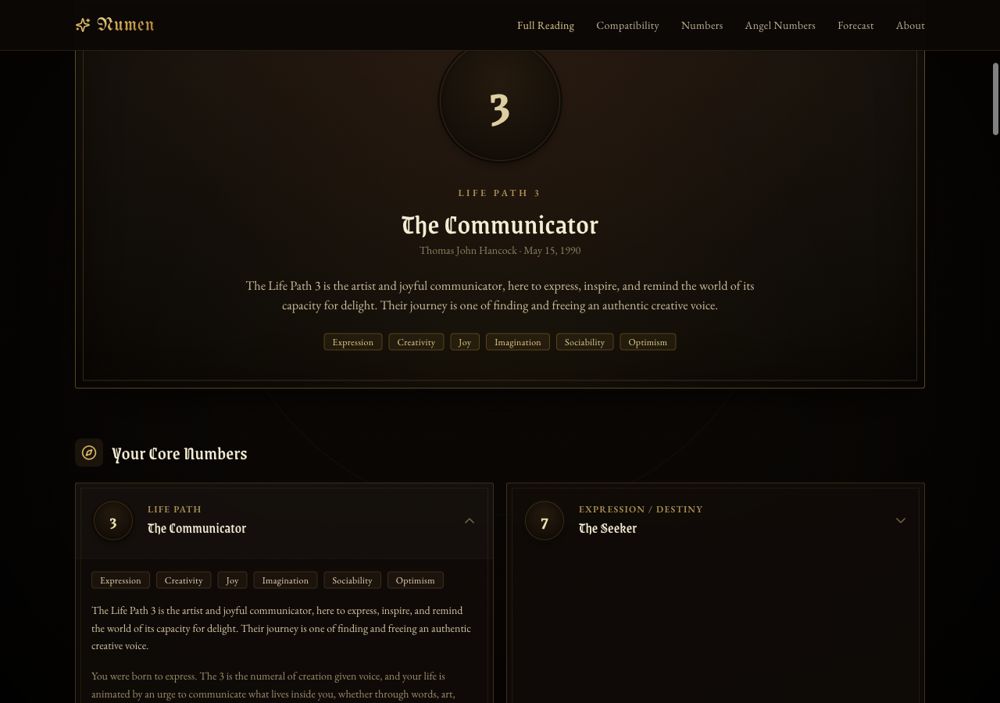

# Numen

A numerology calculator, built as a small Next.js site. Enter a name and a
birth date and it works out the Pythagorean and Chaldean numbers written into
them, then dresses the result up as a dark grimoire. Everything is computed in
the browser; nothing is sent anywhere.

<p align="center">
  
</p>

## What it calculates

The engine lives in [`lib/numerology`](lib/numerology) and is plain TypeScript
with no framework imports, so each function can be called and tested on its
own.

- **Core numbers** ([`core.ts`](lib/numerology/core.ts)): Life Path,
  Expression/Destiny, Soul Urge, Personality, Birthday and Maturity. Master
  numbers 11, 22 and 33 are kept unreduced, and Y can be treated as a vowel.
- **Advanced numbers** ([`advanced.ts`](lib/numerology/advanced.ts)):
  Balance, Karmic Lessons, Hidden Passion, Subconscious Self, Rational
  Thought, Cornerstone, Capstone and First Vowel. Karmic Debt (13, 14, 16,
  19) is flagged on any core number whose unreduced total hits one.
- **Chaldean** ([`chaldean.ts`](lib/numerology/chaldean.ts)): the compound
  and root name number under the Chaldean letter table.
- **Cycles** ([`cycles.ts`](lib/numerology/cycles.ts)): Personal Year, Month
  and Day, plus the four Pinnacles and Challenges with their age ranges.
- **Esoteric extras** ([`esoteric.ts`](lib/numerology/esoteric.ts)): Tarot
  Birth Card, Planes of Expression, Life Cycles, Bridge numbers, Western sun
  sign and Chinese zodiac.
- **Compatibility** ([`compatibility.ts`](lib/numerology/compatibility.ts)):
  a 0-100 harmony score between two Life Paths.
- **Angel numbers** ([`angel.ts`](lib/numerology/angel.ts)): classifies
  sequences such as 111, 1221 or 1234 as repeating, mirrored or ascending.

[`report.ts`](lib/numerology/report.ts) assembles all of the above into one
`Reading` object, which is what the site renders. The text for each number
(meanings, correspondences, the angel-number library) is JSON in
[`content/data`](content/data).

The site has pages for a full reading, compatibility, forecast, angel numbers
and a number-by-number encyclopedia.

## Running it

Package manager is [Bun](https://bun.sh).

```bash
bun install
bun run dev      # http://localhost:3000
bun run build    # production build
bun run start    # serve the build
```

## Tests and checks

```bash
bun run test     # vitest, lib/numerology/*.test.ts
bun run lint     # eslint via next lint
bunx tsc --noEmit
```

The test cases are worked examples from published numerology method guides
(Decoz, numerology.com and others), recorded in
[`content/data/methods_*.json`](content/data). CI runs lint, typecheck, tests
and the build on every push and pull request.

Built with Next.js 15, React 19, Tailwind CSS v4 and TypeScript.

## Disclaimer

This is for reflection and entertainment. It makes no claims about anything.
